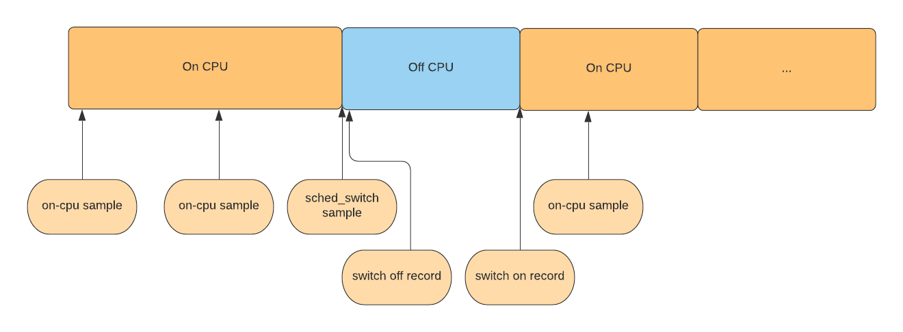

# Executable commands reference

[TOC]

## How simpleperf works

Modern CPUs have a hardware component called the performance monitoring unit (PMU). The PMU has
several hardware counters, counting events like how many cpu cycles have happened, how many
instructions have executed, or how many cache misses have happened.

The Linux kernel wraps these hardware counters into hardware perf events. In addition, the Linux
kernel also provides hardware independent software events and tracepoint events. The Linux kernel
exposes all events to userspace via the perf_event_open system call, which is used by simpleperf.

Simpleperf has three main commands: stat, record and report.

The stat command gives a summary of how many events have happened in the profiled processes in a
time period. Here’s how it works:
1. Given user options, simpleperf enables profiling by making a system call to the kernel.
2. The kernel enables counters while the profiled processes are running.
3. After profiling, simpleperf reads counters from the kernel, and reports a counter summary.

The record command records samples of the profiled processes in a time period. Here’s how it works:
1. Given user options, simpleperf enables profiling by making a system call to the kernel.
2. Simpleperf creates mapped buffers between simpleperf and the kernel.
3. The kernel enables counters while the profiled processes are running.
4. Each time a given number of events happen, the kernel dumps a sample to the mapped buffers.
5. Simpleperf reads samples from the mapped buffers and stores profiling data in a file called
   perf.data.

The report command reads perf.data and any shared libraries used by the profiled processes,
and outputs a report showing where the time was spent.

## Commands

Simpleperf supports several commands, listed below:

```
The debug-unwind command: debug/test dwarf based offline unwinding, used for debugging simpleperf.
The dump command: dumps content in perf.data, used for debugging simpleperf.
The help command: prints help information for other commands.
The kmem command: collects kernel memory allocation information (will be replaced by Python scripts).
The list command: lists all event types supported on the Android device.
The record command: profiles processes and stores profiling data in perf.data.
The report command: reports profiling data in perf.data.
The report-sample command: reports each sample in perf.data, used for supporting integration of
                           simpleperf in Android Studio.
The stat command: profiles processes and prints counter summary.

```

Each command supports different options, which can be seen through help message.

```sh
# List all commands.
$ simpleperf --help

# Print help message for record command.
$ simpleperf record --help
```

Below describes the most frequently used commands, which are list, stat, record and report.

## The list command

The list command lists all events available on the device. Different devices may support different
events because they have different hardware and kernels.

```sh
$ simpleperf list
List of hw-cache events:
  branch-loads
  ...
List of hardware events:
  cpu-cycles
  instructions
  ...
List of software events:
  cpu-clock
  task-clock
  ...
```

On ARM/ARM64, the list command also shows a list of raw events, they are the events supported by
the ARM PMU on the device. The kernel has wrapped part of them into hardware events and hw-cache
events. For example, raw-cpu-cycles is wrapped into cpu-cycles, raw-instruction-retired is wrapped
into instructions. The raw events are provided in case we want to use some events supported on the
device, but unfortunately not wrapped by the kernel.

## The stat command

The stat command is used to get event counter values of the profiled processes. By passing options,
we can select which events to use, which processes/threads to monitor, how long to monitor and the
print interval.

```sh
# Stat using default events (cpu-cycles,instructions,...), and monitor process 7394 for 10 seconds.
$ simpleperf stat -p 7394 --duration 10
Performance counter statistics:

 1,320,496,145  cpu-cycles         # 0.131736 GHz                     (100%)
   510,426,028  instructions       # 2.587047 cycles per instruction  (100%)
     4,692,338  branch-misses      # 468.118 K/sec                    (100%)
886.008130(ms)  task-clock         # 0.088390 cpus used               (100%)
           753  context-switches   # 75.121 /sec                      (100%)
           870  page-faults        # 86.793 /sec                      (100%)

Total test time: 10.023829 seconds.
```

### Select events to stat

We can select which events to use via -e.

```sh
# Stat event cpu-cycles.
$ simpleperf stat -e cpu-cycles -p 11904 --duration 10

# Stat event cache-references and cache-misses.
$ simpleperf stat -e cache-references,cache-misses -p 11904 --duration 10
```

When running the stat command, if the number of hardware events is larger than the number of
hardware counters available in the PMU, the kernel shares hardware counters between events, so each
event is only monitored for part of the total time. In the example below, there is a percentage at
the end of each row, showing the percentage of the total time that each event was actually
monitored.

```sh
# Stat using event cache-references, cache-references:u,....
$ simpleperf stat -p 7394 -e cache-references,cache-references:u,cache-references:k \
      -e cache-misses,cache-misses:u,cache-misses:k,instructions --duration 1
Performance counter statistics:

4,331,018  cache-references     # 4.861 M/sec    (87%)
3,064,089  cache-references:u   # 3.439 M/sec    (87%)
1,364,959  cache-references:k   # 1.532 M/sec    (87%)
   91,721  cache-misses         # 102.918 K/sec  (87%)
   45,735  cache-misses:u       # 51.327 K/sec   (87%)
   38,447  cache-misses:k       # 43.131 K/sec   (87%)
9,688,515  instructions         # 10.561 M/sec   (89%)

Total test time: 1.026802 seconds.
```

In the example above, each event is monitored about 87% of the total time. But there is no
guarantee that any pair of events are always monitored at the same time. If we want to have some
events monitored at the same time, we can use --group.

```sh
# Stat using event cache-references, cache-references:u,....
$ simpleperf stat -p 7964 --group cache-references,cache-misses \
      --group cache-references:u,cache-misses:u --group cache-references:k,cache-misses:k \
      -e instructions --duration 1
Performance counter statistics:

3,638,900  cache-references     # 4.786 M/sec          (74%)
   65,171  cache-misses         # 1.790953% miss rate  (74%)
2,390,433  cache-references:u   # 3.153 M/sec          (74%)
   32,280  cache-misses:u       # 1.350383% miss rate  (74%)
  879,035  cache-references:k   # 1.251 M/sec          (68%)
   30,303  cache-misses:k       # 3.447303% miss rate  (68%)
8,921,161  instructions         # 10.070 M/sec         (86%)

Total test time: 1.029843 seconds.
```

### Select target to stat

We can select which processes or threads to monitor via -p or -t. Monitoring a
process is the same as monitoring all threads in the process. Simpleperf can also fork a child
process to run the new command and then monitor the child process.

```sh
# Stat process 11904 and 11905.
$ simpleperf stat -p 11904,11905 --duration 10

# Stat thread 11904 and 11905.
$ simpleperf stat -t 11904,11905 --duration 10

# Start a child process running `ls`, and stat it.
$ simpleperf stat ls

# Stat the process of an Android application. This only works for debuggable apps on non-rooted
# devices.
$ simpleperf stat --app simpleperf.example.cpp

# Stat system wide using -a.
$ simpleperf stat -a --duration 10
```

### Decide how long to stat

When monitoring existing threads, we can use --duration to decide how long to monitor. When
monitoring a child process running a new command, simpleperf monitors until the child process ends.
In this case, we can use Ctrl-C to stop monitoring at any time.

```sh
# Stat process 11904 for 10 seconds.
$ simpleperf stat -p 11904 --duration 10

# Stat until the child process running `ls` finishes.
$ simpleperf stat ls

# Stop monitoring using Ctrl-C.
$ simpleperf stat -p 11904 --duration 10
^C
```

If you want to write a script to control how long to monitor, you can send one of SIGINT, SIGTERM,
SIGHUP signals to simpleperf to stop monitoring.

### Decide the print interval

When monitoring perf counters, we can also use --interval to decide the print interval.

```sh
# Print stat for process 11904 every 300ms.
$ simpleperf stat -p 11904 --duration 10 --interval 300

# Print system wide stat at interval of 300ms for 10 seconds. Note that system wide profiling needs
# root privilege.
$ su 0 simpleperf stat -a --duration 10 --interval 300
```

### Display counters in systrace

Simpleperf can also work with systrace to dump counters in the collected trace. Below is an example
to do a system wide stat.

```sh
# Capture instructions (kernel only) and cache misses with interval of 300 milliseconds for 15
# seconds.
$ su 0 simpleperf stat -e instructions:k,cache-misses -a --interval 300 --duration 15
# On host launch systrace to collect trace for 10 seconds.
(HOST)$ external/chromium-trace/systrace.py --time=10 -o new.html sched gfx view
# Open the collected new.html in browser and perf counters will be shown up.
```

### Show event count per thread

By default, stat cmd outputs an event count sum for all monitored targets. But when `--per-thread`
option is used, stat cmd outputs an event count for each thread in monitored targets. It can be
used to find busy threads in a process or system wide. With `--per-thread` option, stat cmd opens
a perf_event_file for each exisiting thread. If a monitored thread creates new threads, event
count for new threads will be added to the monitored thread by default, otherwise omitted if
`--no-inherit` option is also used.

```sh
# Print event counts for each thread in process 11904. Event counts for threads created after
# stat cmd will be added to threads creating them.
$ simpleperf stat --per-thread -p 11904 --duration 1

# Print event counts for all threads running in the system every 1s. Threads not running will not
# be reported.
$ su 0 simpleperf stat --per-thread -a --interval 1000 --interval-only-values

# Print event counts for all threads running in the system every 1s. Event counts for threads
# created after stat cmd will be omitted.
$ su 0 simpleperf stat --per-thread -a --interval 1000 --interval-only-values --no-inherit
```

### Show event count per core

By default, stat cmd outputs an event count sum for all monitored cpu cores. But when `--per-core`
option is used, stat cmd outputs an event count for each core. It can be used to see how events
are distributed on different cores.
When stating non-system wide with `--per-core` option, simpleperf creates a perf event for each
monitored thread on each core. When a thread is in running state, perf events on all cores are
enabled, but only the perf event on the core running the thread is in running state. So the
percentage comment shows runtime_on_a_core / runtime_on_all_cores. Note that, percentage is still
affected by hardware counter multiplexing. Check simpleperf log output for ways to distinguish it.

```sh
# Print event counts for each cpu running threads in process 11904.
# A percentage shows runtime_on_a_cpu / runtime_on_all_cpus.
$ simpleperf stat --per-core -p 11904 --duration 1
Performance counter statistics:

# cpu       count  event_name   # percentage = event_run_time / enabled_time
  7    56,552,838  cpu-cycles   #   (60%)
  3    25,958,605  cpu-cycles   #   (20%)
  0    22,822,698  cpu-cycles   #   (15%)
  1     6,661,495  cpu-cycles   #   (5%)
  4     1,519,093  cpu-cycles   #   (0%)

Total test time: 1.001082 seconds.

# Print event counts for each cpu system wide.
$ su 0 simpleperf stat --per-core -a --duration 1

# Print cpu-cycle event counts for each cpu for each thread running in the system.
$ su 0 simpleperf stat -e cpu-cycles -a --per-thread --per-core --duration 1
```

## The record command

The record command is used to dump samples of the profiled processes. Each sample can contain
information like the time at which the sample was generated, the number of events since last
sample, the program counter of a thread, the call chain of a thread.

By passing options, we can select which events to use, which processes/threads to monitor,
what frequency to dump samples, how long to monitor, and where to store samples.

```sh
# Record on process 7394 for 10 seconds, using default event (cpu-cycles), using default sample
# frequency (4000 samples per second), writing records to perf.data.
$ simpleperf record -p 7394 --duration 10
simpleperf I cmd_record.cpp:316] Samples recorded: 21430. Samples lost: 0.
```

### Select events to record

By default, the cpu-cycles event is used to evaluate consumed cpu cycles. But we can also use other
events via -e.

```sh
# Record using event instructions.
$ simpleperf record -e instructions -p 11904 --duration 10

# Record using task-clock, which shows the passed CPU time in nanoseconds.
$ simpleperf record -e task-clock -p 11904 --duration 10
```

### Select target to record

The way to select target in record command is similar to that in the stat command.

```sh
# Record process 11904 and 11905.
$ simpleperf record -p 11904,11905 --duration 10

# Record thread 11904 and 11905.
$ simpleperf record -t 11904,11905 --duration 10

# Record a child process running `ls`.
$ simpleperf record ls

# Record the process of an Android application. This only works for debuggable apps on non-rooted
# devices.
$ simpleperf record --app simpleperf.example.cpp

# Record system wide.
$ simpleperf record -a --duration 10
```

### Set the frequency to record

We can set the frequency to dump records via -f or -c. For example, -f 4000 means
dumping approximately 4000 records every second when the monitored thread runs. If a monitored
thread runs 0.2s in one second (it can be preempted or blocked in other times), simpleperf dumps
about 4000 * 0.2 / 1.0 = 800 records every second. Another way is using -c. For example, -c 10000
means dumping one record whenever 10000 events happen.

```sh
# Record with sample frequency 1000: sample 1000 times every second running.
$ simpleperf record -f 1000 -p 11904,11905 --duration 10

# Record with sample period 100000: sample 1 time every 100000 events.
$ simpleperf record -c 100000 -t 11904,11905 --duration 10
```

To avoid taking too much time generating samples, kernel >= 3.10 sets the max percent of cpu time
used for generating samples (default is 25%), and decreases the max allowed sample frequency when
hitting that limit. Simpleperf uses --cpu-percent option to adjust it, but it needs either root
privilege or to be on Android >= Q.

```sh
# Record with sample frequency 10000, with max allowed cpu percent to be 50%.
$ simpleperf record -f 1000 -p 11904,11905 --duration 10 --cpu-percent 50
```

### Decide how long to record

The way to decide how long to monitor in record command is similar to that in the stat command.

```sh
# Record process 11904 for 10 seconds.
$ simpleperf record -p 11904 --duration 10

# Record until the child process running `ls` finishes.
$ simpleperf record ls

# Stop monitoring using Ctrl-C.
$ simpleperf record -p 11904 --duration 10
^C
```

If you want to write a script to control how long to monitor, you can send one of SIGINT, SIGTERM,
SIGHUP signals to simpleperf to stop monitoring.

### Set the path to store profiling data

By default, simpleperf stores profiling data in perf.data in the current directory. But the path
can be changed using -o.

```sh
# Write records to data/perf2.data.
$ simpleperf record -p 11904 -o data/perf2.data --duration 10
```

#### Record call graphs

A call graph is a tree showing function call relations. Below is an example.

```
main() {
    FunctionOne();
    FunctionTwo();
}
FunctionOne() {
    FunctionTwo();
    FunctionThree();
}
a call graph:
    main-> FunctionOne
       |    |
       |    |-> FunctionTwo
       |    |-> FunctionThree
       |
       |-> FunctionTwo
```

A call graph shows how a function calls other functions, and a reversed call graph shows how
a function is called by other functions. To show a call graph, we need to first record it, then
report it.

There are two ways to record a call graph, one is recording a dwarf based call graph, the other is
recording a stack frame based call graph. Recording dwarf based call graphs needs support of debug
information in native binaries. While recording stack frame based call graphs needs support of
stack frame registers.

```sh
# Record a dwarf based call graph
$ simpleperf record -p 11904 -g --duration 10

# Record a stack frame based call graph
$ simpleperf record -p 11904 --call-graph fp --duration 10
```

[Here](README.md#suggestions-about-recording-call-graphs) are some suggestions about recording call graphs.

### Record both on CPU time and off CPU time

Simpleperf is a CPU profiler, which generates samples for a thread only when it is running on a
CPU. But sometimes we want to know where the thread time is spent off-cpu (like preempted by other
threads, blocked in IO or waiting for some events). To support this, simpleperf added a
--trace-offcpu option to the record command. When --trace-offcpu is used, simpleperf does the
following things:

1) Only cpu-clock/task-clock event is allowed to be used with --trace-offcpu. This let simpleperf
   generate on-cpu samples for cpu-clock event.
2) Simpleperf also monitors sched:sched_switch event, which will generate a sched_switch sample
   each time the monitored thread is scheduled off cpu.
3) Simpleperf also records context switch records. So it knows when the thread is scheduled back on
   a cpu.

The samples and context switch records collected by simpleperf for a thread are shown below:



Here we have two types of samples:
1) on-cpu samples generated for cpu-clock event. The period value in each sample means how many
   nanoseconds are spent on cpu (for the callchain of this sample).
2) off-cpu (sched_switch) samples generated for sched:sched_switch event. The period value is
   calculated as **Timestamp of the next switch on record** minus **Timestamp of the current sample**
   by simpleperf. So the period value in each sample means how many nanoseconds are spent off cpu
   (for the callchain of this sample).

**note**: In reality, switch on records and samples may lost. To mitigate the loss of accuracy, we
calculate the period of an off-cpu sample as **Timestamp of the next switch on record or sample**
minus **Timestamp of the current sample**.

When reporting via python scripts, simpleperf_report_lib.py provides SetTraceOffCpuMode() method
to control how to report the samples:
1) on-cpu mode: only report on-cpu samples.
2) off-cpu mode: only report off-cpu samples.
3) on-off-cpu mode: report both on-cpu and off-cpu samples, which can be split by event name.
4) mixed-on-off-cpu mode: report on-cpu and off-cpu samples under the same event name.

If not set, mixed-on-off-cpu mode will be used to report.

When using report_html.py, inferno and report_sample.py, the report mode can be set by
--trace-offcpu option.

Below are some examples recording and reporting trace offcpu profiles.

```sh
# Check if --trace-offcpu is supported by the kernel (should be available on kernel >= 4.2).
$ simpleperf list --show-features
trace-offcpu
...

# Record with --trace-offcpu.
$ simpleperf record -g -p 11904 --duration 10 --trace-offcpu -e cpu-clock

# Record system wide with --trace-offcpu.
$ simpleperf record -a -g --duration 3 --trace-offcpu -e cpu-clock

# Record with --trace-offcpu using app_profiler.py.
$ ./app_profiler.py -p com.google.samples.apps.sunflower \
    -r "-g -e cpu-clock:u --duration 10 --trace-offcpu"

# Report on-cpu samples.
$ ./report_html.py --trace-offcpu on-cpu
# Report off-cpu samples.
$ ./report_html.py --trace-offcpu off-cpu
# Report on-cpu and off-cpu samples under different event names.
$ ./report_html.py --trace-offcpu on-off-cpu
# Report on-cpu and off-cpu samples under the same event name.
$ ./report_html.py --trace-offcpu mixed-on-off-cpu
```

## The report command

The report command is used to report profiling data generated by the record command. The report
contains a table of sample entries. Each sample entry is a row in the report. The report command
groups samples belong to the same process, thread, library, function in the same sample entry. Then
sort the sample entries based on the event count a sample entry has.

By passing options, we can decide how to filter out uninteresting samples, how to group samples
into sample entries, and where to find profiling data and binaries.

Below is an example. Records are grouped into 4 sample entries, each entry is a row. There are
several columns, each column shows piece of information belonging to a sample entry. The first
column is Overhead, which shows the percentage of events inside the current sample entry in total
events. As the perf event is cpu-cycles, the overhead is the percentage of CPU cycles used in each
function.

```sh
# Reports perf.data, using only records sampled in libsudo-game-jni.so, grouping records using
# thread name(comm), process id(pid), thread id(tid), function name(symbol), and showing sample
# count for each row.
$ simpleperf report --dsos /data/app/com.example.sudogame-2/lib/arm64/libsudo-game-jni.so \
      --sort comm,pid,tid,symbol -n
Cmdline: /data/data/com.example.sudogame/simpleperf record -p 7394 --duration 10
Arch: arm64
Event: cpu-cycles (type 0, config 0)
Samples: 28235
Event count: 546356211

Overhead  Sample  Command    Pid   Tid   Symbol
59.25%    16680   sudogame  7394  7394  checkValid(Board const&, int, int)
20.42%    5620    sudogame  7394  7394  canFindSolution_r(Board&, int, int)
13.82%    4088    sudogame  7394  7394  randomBlock_r(Board&, int, int, int, int, int)
6.24%     1756    sudogame  7394  7394  @plt
```

### Set the path to read profiling data

By default, the report command reads profiling data from perf.data in the current directory.
But the path can be changed using -i.

```sh
$ simpleperf report -i data/perf2.data
```

### Set the path to find binaries

To report function symbols, simpleperf needs to read executable binaries used by the monitored
processes to get symbol table and debug information. By default, the paths are the executable
binaries used by monitored processes while recording. However, these binaries may not exist when
reporting or not contain symbol table and debug information. So we can use --symfs to redirect
the paths.

```sh
# In this case, when simpleperf wants to read executable binary /A/b, it reads file in /A/b.
$ simpleperf report

# In this case, when simpleperf wants to read executable binary /A/b, it prefers file in
# /debug_dir/A/b to file in /A/b.
$ simpleperf report --symfs /debug_dir

# Read symbols for system libraries built locally. Note that this is not needed since Android O,
# which ships symbols for system libraries on device.
$ simpleperf report --symfs $ANDROID_PRODUCT_OUT/symbols
```

### Filter samples

When reporting, it happens that not all records are of interest. The report command supports four
filters to select samples of interest.

```sh
# Report records in threads having name sudogame.
$ simpleperf report --comms sudogame

# Report records in process 7394 or 7395
$ simpleperf report --pids 7394,7395

# Report records in thread 7394 or 7395.
$ simpleperf report --tids 7394,7395

# Report records in libsudo-game-jni.so.
$ simpleperf report --dsos /data/app/com.example.sudogame-2/lib/arm64/libsudo-game-jni.so
```

### Group samples into sample entries

The report command uses --sort to decide how to group sample entries.

```sh
# Group records based on their process id: records having the same process id are in the same
# sample entry.
$ simpleperf report --sort pid

# Group records based on their thread id and thread comm: records having the same thread id and
# thread name are in the same sample entry.
$ simpleperf report --sort tid,comm

# Group records based on their binary and function: records in the same binary and function are in
# the same sample entry.
$ simpleperf report --sort dso,symbol

# Default option: --sort comm,pid,tid,dso,symbol. Group records in the same thread, and belong to
# the same function in the same binary.
$ simpleperf report
```

#### Report call graphs

To report a call graph, please make sure the profiling data is recorded with call graphs,
as [here](#record-call-graphs).

```
$ simpleperf report -g
```
